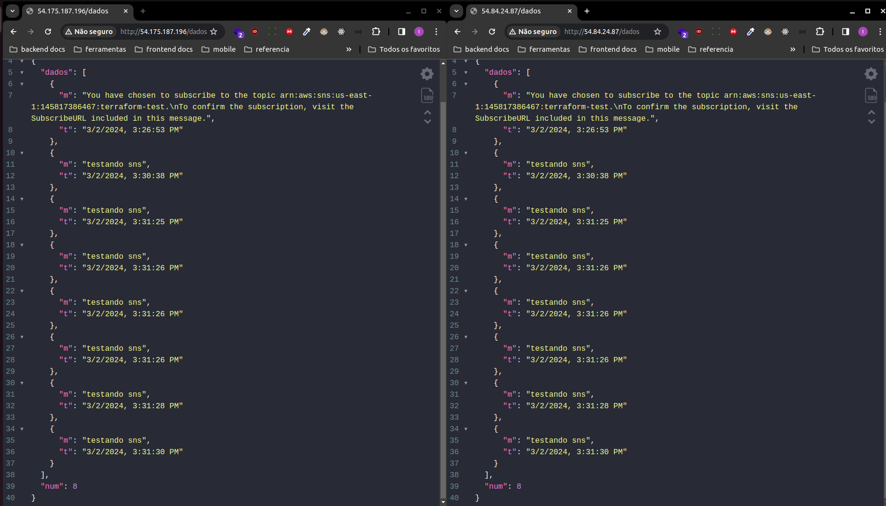
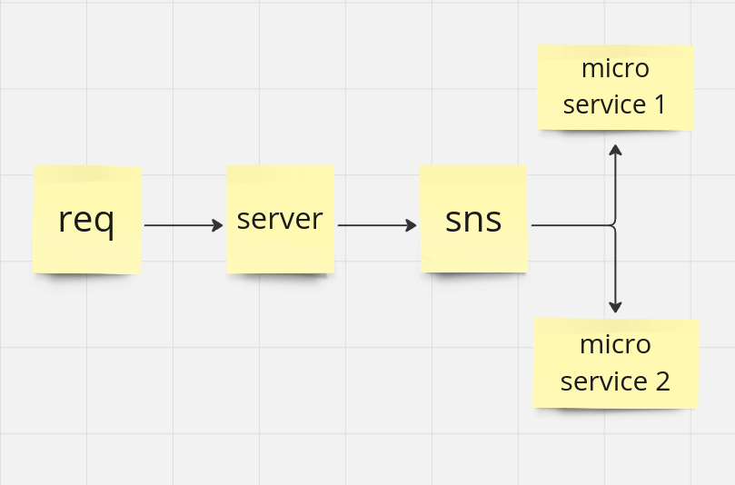

# AWS SNS

<div style="display: flex; justify-content: center; align-items: center; height: 100%; margin: 0;">
  <div style="display: flex; width: 100%; height: 100%;">
      <div style="flex: 1; display: flex; justify-content: center; align-items: center;">
          
      </div>
      <div style="flex: 1; display: flex; justify-content: center; align-items: center;">
          
      </div>
  </div>
</div>

# Como Executar o Projeto

- Ter o terraform instalado na sua maquina
- Pegar sua chave ssh pública e adicionar no arquivo na pasta `terraform/vm`
- Abrir o terminal e expor esses valores

  - ```bash
    export AWS_ACCESS_KEY_ID="sua key"
    export AWS_SECRET_ACCESS_KEY="sua secret"

    cd terraform/vm
    terraform init
    terraform fmt
    terraform validate
    terraform
    terraform plan -out plan.out
    terraform apply plan.out
    ```

- Acessar as vms e rodar todos os comandos do arquivo `script/vps.sh`
- Pegar os ips das maquinas, adicionar no `resource` de `resoaws_sns_topic_subscription`
  - ```bash
      resource "aws_sns_topic_subscription" "http_subscription_microservice1" {
        topic_arn = aws_sns_topic.sns.arn
        protocol  = "http"
        endpoint  = "http://54.175.187.196"
      }
      resource "aws_sns_topic_subscription" "http_subscription_microservice2" {
        topic_arn = aws_sns_topic.sns.arn
        protocol  = "http"
        endpoint  = "http://54.84.24.87"
      }
    ```
- Depois acessar a pasta terraform/sns e rodar esses comandos:
  - ```bash
      cd terraform/sns
      terraform init
      terraform fmt
      terraform validate
      terraform
      terraform plan -out plan.out
      terraform apply plan.out
    ```
- Pegar o ARN do tópico criado e adicionar o valor na variável de ambiente `TOPIC_ARN` no arquivo `.env`
- verificar o log das vms, é acessar a url que estará no log, para se inscrever no tópico.
- Acessar a pasta server e rodar a aplicação localmente.
- Fazer as requisições para enviar as mensagens para o tópico
